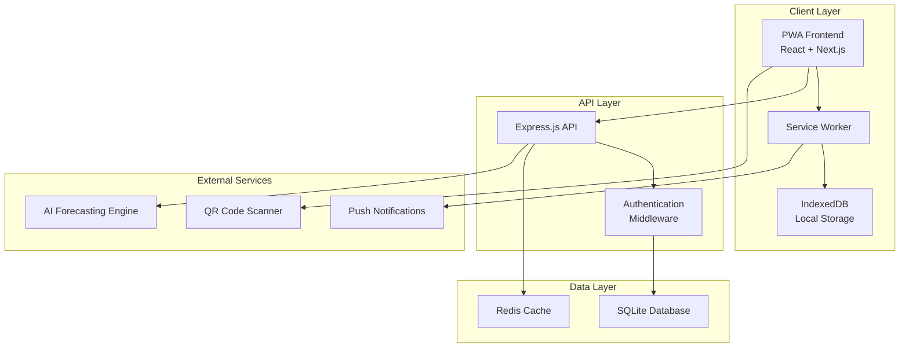
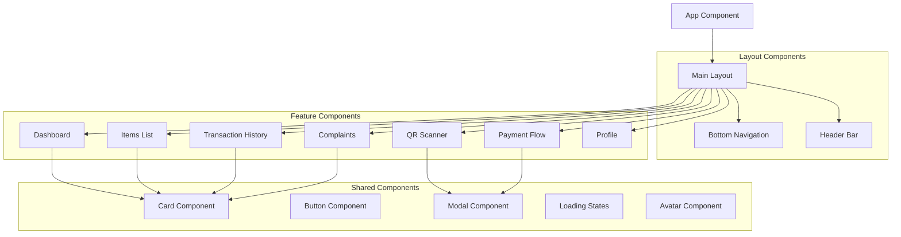

# Design Document

## Overview

DigiRation is a mobile-first Progressive Web App built with React/Next.js frontend and Express.js backend. The architecture prioritizes offline-first functionality, mobile UX patterns, and scalable data management for ration distribution systems across India.

## Architecture

### System Architecture



### Technology Stack

**Frontend:**
- React 18 with Next.js 14 (App Router)
- TypeScript for type safety
- Tailwind CSS for mobile-first responsive design
- PWA features with next-pwa plugin
- React Query for state management and caching
- Zustand for client-side state management

**Backend:**
- Express.js with TypeScript
- SQLite with better-sqlite3 for development
- JWT for authentication
- Zod for request validation
- Winston for logging

**Mobile/PWA:**
- Service Worker for offline functionality
- IndexedDB for local data storage
- Web Push API for notifications
- Camera API for QR code scanning
- Workbox for caching strategies

## Components and Interfaces

### Frontend Component Architecture



### Key Component Specifications

**Authentication Flow Components:**
- Ration ID and phone number input form
- OTP verification interface with resend functionality
- Family member selection grid with avatars
- Aadhaar verification form (bypassed for demo)

**Dashboard Component:**
- Personal profile card for authenticated user
- Quick stats: available quota, recent transactions
- Action buttons: scan QR, view items, check history
- Navigation options organized in mobile-friendly grid

**Items List Component:**
- Card-based layout for each ration item
- Stock indicator with progress bars
- Quota vs available comparison
- Add to cart functionality for planning

**Transaction History Component:**
- Infinite scroll list with virtual scrolling
- Filter chips for member, date, status
- Expandable transaction details
- Status badges with color coding

**QR Scanner Component:**
- Full-screen camera overlay
- Scanning guide overlay
- Auto-focus and torch controls
- Transaction confirmation modal

### API Interface Design

**Authentication Endpoints:**
```typescript
POST /api/auth/initiate        // Ration ID + Phone number
POST /api/auth/verify-otp      // OTP verification
GET /api/auth/family-members   // Get family members for ration card
POST /api/auth/select-member   // Select family member
POST /api/auth/verify-aadhaar  // Aadhaar verification (bypassed)
POST /api/auth/refresh
POST /api/auth/logout
```

**User & Family Endpoints:**
```typescript
GET /api/user/profile
GET /api/user/family
PUT /api/user/family/:memberId
```

**Ration Management Endpoints:**
```typescript
GET /api/rations/items
GET /api/rations/quota/:memberId
GET /api/rations/stock/:shopId
```

**Transaction Endpoints:**
```typescript
GET /api/transactions/history
POST /api/transactions/create
PUT /api/transactions/:id/status
POST /api/transactions/qr-verify
```

**Payment Endpoints:**
```typescript
POST /api/payments/initiate
POST /api/payments/verify
GET /api/payments/methods
```

**Complaints Endpoints:**
```typescript
GET /api/complaints
POST /api/complaints/create
PUT /api/complaints/:id/update
```

## Data Models

### Core Data Structures

**User/Family Model:**
```typescript
interface User {
  id: string;
  rationCardId: string;
  familyName: string;
  phoneNumber: string;
  address: Address;
  language: 'en' | 'hi' | 'ta' | 'te';
  createdAt: Date;
  updatedAt: Date;
}

interface FamilyMember {
  id: string;
  userId: string;
  name: string;
  age: number;
  gender: 'M' | 'F' | 'O';
  avatarUrl: string;
  isHead: boolean;
  quota: RationQuota[];
}

interface RationQuota {
  itemId: string;
  monthlyLimit: number;
  currentUsed: number;
  resetDate: Date;
}
```

**Ration Items Model:**
```typescript
interface RationItem {
  id: string;
  name: string;
  nameTranslations: Record<string, string>;
  category: 'grains' | 'pulses' | 'oil' | 'sugar' | 'other';
  unit: 'kg' | 'liter' | 'piece';
  pricePerUnit: number;
  imageUrl: string;
  isActive: boolean;
}

interface ShopStock {
  shopId: string;
  itemId: string;
  availableQuantity: number;
  lastUpdated: Date;
  priceOverride?: number;
}
```

**Transaction Model:**
```typescript
interface Transaction {
  id: string;
  userId: string;
  memberId: string;
  shopId: string;
  items: TransactionItem[];
  totalAmount: number;
  paymentMethod: 'cash' | 'upi' | 'card' | 'qr';
  paymentStatus: 'pending' | 'completed' | 'failed' | 'refunded';
  status: 'initiated' | 'verified' | 'completed' | 'cancelled';
  qrCode?: string;
  createdAt: Date;
  completedAt?: Date;
}

interface TransactionItem {
  itemId: string;
  quantity: number;
  unitPrice: number;
  totalPrice: number;
}
```

**Complaint Model:**
```typescript
interface Complaint {
  id: string;
  userId: string;
  category: 'stock' | 'quality' | 'pricing' | 'service' | 'technical' | 'other';
  title: string;
  description: string;
  priority: 'low' | 'medium' | 'high' | 'urgent';
  status: 'open' | 'in_progress' | 'resolved' | 'closed';
  attachments: string[];
  responses: ComplaintResponse[];
  createdAt: Date;
  updatedAt: Date;
}
```

### Database Schema

**SQLite Tables:**
```sql
-- Users and Family Management
CREATE TABLE users (
  id TEXT PRIMARY KEY,
  ration_card_id TEXT UNIQUE NOT NULL,
  family_name TEXT NOT NULL,
  phone_number TEXT NOT NULL,
  address_json TEXT NOT NULL,
  language TEXT DEFAULT 'en',
  created_at DATETIME DEFAULT CURRENT_TIMESTAMP,
  updated_at DATETIME DEFAULT CURRENT_TIMESTAMP
);

CREATE TABLE family_members (
  id TEXT PRIMARY KEY,
  user_id TEXT NOT NULL,
  name TEXT NOT NULL,
  age INTEGER NOT NULL,
  gender TEXT CHECK(gender IN ('M', 'F', 'O')),
  avatar_url TEXT,
  is_head BOOLEAN DEFAULT FALSE,
  created_at DATETIME DEFAULT CURRENT_TIMESTAMP,
  FOREIGN KEY (user_id) REFERENCES users(id)
);

-- Ration Management
CREATE TABLE ration_items (
  id TEXT PRIMARY KEY,
  name TEXT NOT NULL,
  name_translations TEXT, -- JSON
  category TEXT NOT NULL,
  unit TEXT NOT NULL,
  price_per_unit DECIMAL(10,2) NOT NULL,
  image_url TEXT,
  is_active BOOLEAN DEFAULT TRUE,
  created_at DATETIME DEFAULT CURRENT_TIMESTAMP
);

CREATE TABLE member_quotas (
  id TEXT PRIMARY KEY,
  member_id TEXT NOT NULL,
  item_id TEXT NOT NULL,
  monthly_limit DECIMAL(10,2) NOT NULL,
  current_used DECIMAL(10,2) DEFAULT 0,
  reset_date DATE NOT NULL,
  FOREIGN KEY (member_id) REFERENCES family_members(id),
  FOREIGN KEY (item_id) REFERENCES ration_items(id)
);

-- Transactions
CREATE TABLE transactions (
  id TEXT PRIMARY KEY,
  user_id TEXT NOT NULL,
  member_id TEXT NOT NULL,
  shop_id TEXT NOT NULL,
  total_amount DECIMAL(10,2) NOT NULL,
  payment_method TEXT NOT NULL,
  payment_status TEXT DEFAULT 'pending',
  status TEXT DEFAULT 'initiated',
  qr_code TEXT,
  created_at DATETIME DEFAULT CURRENT_TIMESTAMP,
  completed_at DATETIME,
  FOREIGN KEY (user_id) REFERENCES users(id),
  FOREIGN KEY (member_id) REFERENCES family_members(id)
);

CREATE TABLE transaction_items (
  id TEXT PRIMARY KEY,
  transaction_id TEXT NOT NULL,
  item_id TEXT NOT NULL,
  quantity DECIMAL(10,2) NOT NULL,
  unit_price DECIMAL(10,2) NOT NULL,
  total_price DECIMAL(10,2) NOT NULL,
  FOREIGN KEY (transaction_id) REFERENCES transactions(id),
  FOREIGN KEY (item_id) REFERENCES ration_items(id)
);
```

## Error Handling

### Frontend Error Boundaries

**Global Error Boundary:**
- Catches unhandled React errors
- Displays user-friendly error messages
- Logs errors for debugging
- Provides retry mechanisms

**Network Error Handling:**
- Automatic retry with exponential backoff
- Offline queue for failed requests
- User notification for network issues
- Graceful degradation to cached data

**Validation Error Handling:**
- Real-time form validation
- Clear error messages in user's language
- Field-level error indicators
- Accessibility-compliant error announcements

### Backend Error Handling

**API Error Response Format:**
```typescript
interface ApiError {
  success: false;
  error: {
    code: string;
    message: string;
    details?: any;
    timestamp: string;
  };
}
```

**Error Categories:**
- Authentication errors (401, 403)
- Validation errors (400)
- Not found errors (404)
- Server errors (500)
- Rate limiting (429)

## Testing Strategy

### Frontend Testing

**Unit Testing:**
- Jest + React Testing Library
- Component behavior testing
- Hook testing with custom hooks
- Utility function testing

**Integration Testing:**
- API integration tests
- Service worker functionality
- IndexedDB operations
- Camera/QR scanner integration

**E2E Testing:**
- Playwright for mobile viewport testing
- Critical user journeys
- Offline functionality testing
- PWA installation testing

### Backend Testing

**Unit Testing:**
- Jest for API endpoints
- Database operation testing
- Authentication middleware testing
- Validation schema testing

**Integration Testing:**
- Database integration tests
- External service mocking
- End-to-end API workflows

### Mobile Testing Strategy

**Device Testing:**
- Chrome DevTools mobile simulation
- Real device testing on Android/iOS
- Touch interaction testing
- Performance testing on low-end devices

**PWA Testing:**
- Service worker registration
- Offline functionality
- App installation flow
- Push notification delivery

### Performance Testing

**Frontend Performance:**
- Lighthouse audits for PWA compliance
- Bundle size optimization
- Image optimization testing
- Loading performance metrics

**Backend Performance:**
- API response time testing
- Database query optimization
- Concurrent user load testing
- Memory usage monitoring

## Mobile UX Patterns

### Navigation Design

**Bottom Tab Navigation:**
- 5 primary tabs: Home, Items, History, Scan, Profile
- Active state indicators
- Badge notifications for updates
- Thumb-friendly positioning

**Gesture Support:**
- Pull-to-refresh on lists
- Swipe actions on transaction items
- Pinch-to-zoom on QR codes
- Long press for context menus

### Touch Interactions

**Button Design:**
- Minimum 44px touch targets
- Visual feedback on press
- Loading states for async actions
- Disabled states with clear indicators

**Form Design:**
- Large input fields with clear labels
- Floating labels for space efficiency
- Input validation with inline feedback
- Keyboard optimization for input types

### Responsive Breakpoints

```css
/* Mobile First Approach */
.container {
  /* Base: 320px+ (small phones) */
  padding: 1rem;
}

@media (min-width: 375px) {
  /* Large phones */
  .container {
    padding: 1.25rem;
  }
}

@media (min-width: 768px) {
  /* Tablets */
  .container {
    max-width: 600px;
    margin: 0 auto;
  }
}

@media (min-width: 1024px) {
  /* Desktop */
  .container {
    max-width: 800px;
  }
}
```

## Offline Strategy

### Service Worker Implementation

**Caching Strategy:**
- App shell caching (HTML, CSS, JS)
- API response caching with TTL
- Image caching with size limits
- Background sync for transactions

**Offline Queue:**
- Queue failed API requests
- Retry with exponential backoff
- Conflict resolution for data sync
- User notification of sync status

### Data Synchronization

**Sync Priorities:**
1. Critical: Transaction data, quota updates
2. Important: Stock levels, complaint updates
3. Normal: Profile changes, preferences
4. Low: Analytics, non-critical updates

**Conflict Resolution:**
- Last-write-wins for user preferences
- Server-authoritative for quotas and stock
- Merge strategies for complaint updates
- User confirmation for critical conflicts